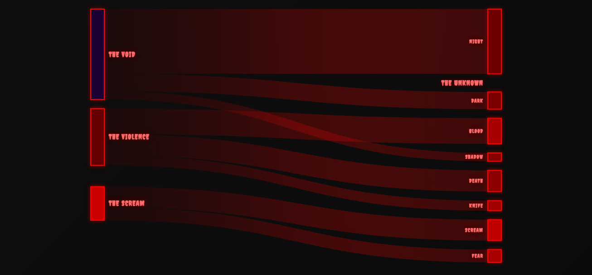
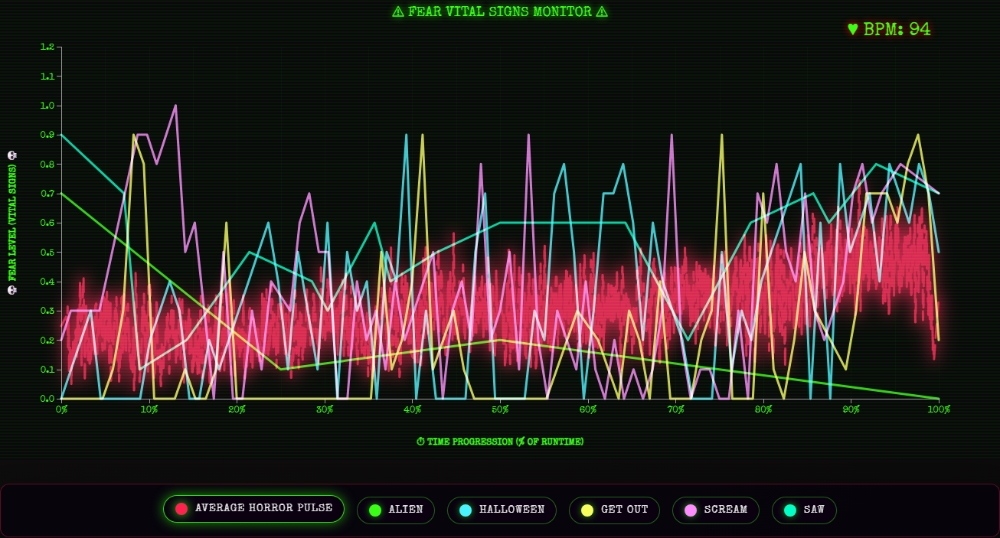
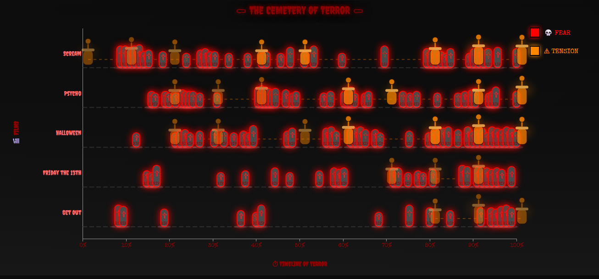
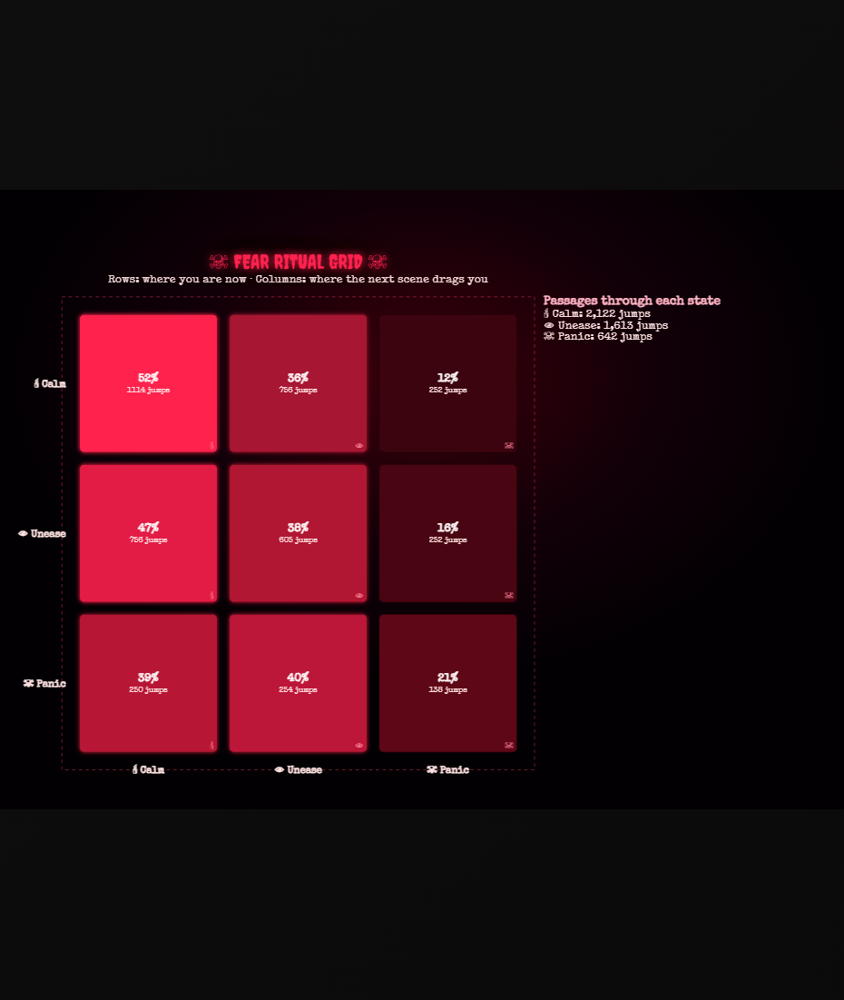
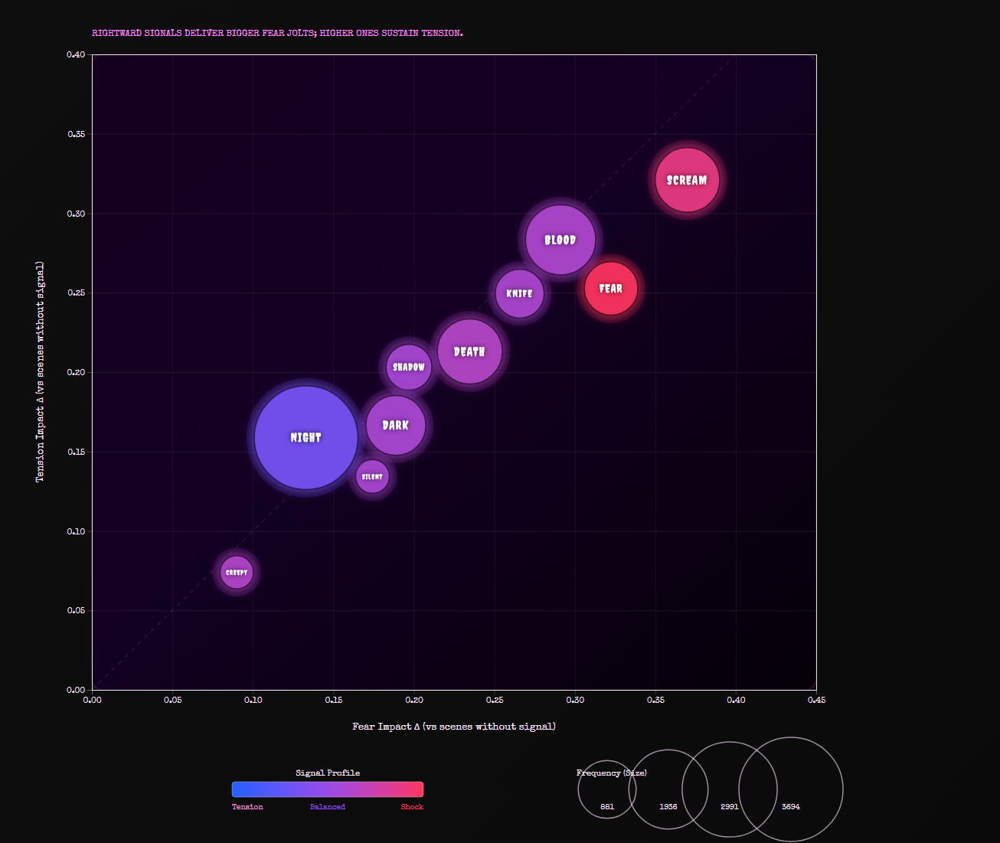
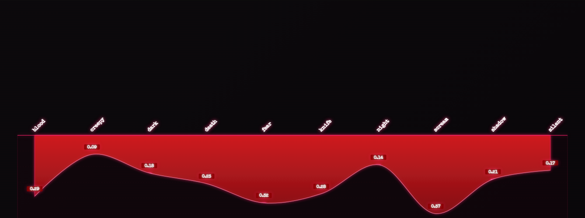
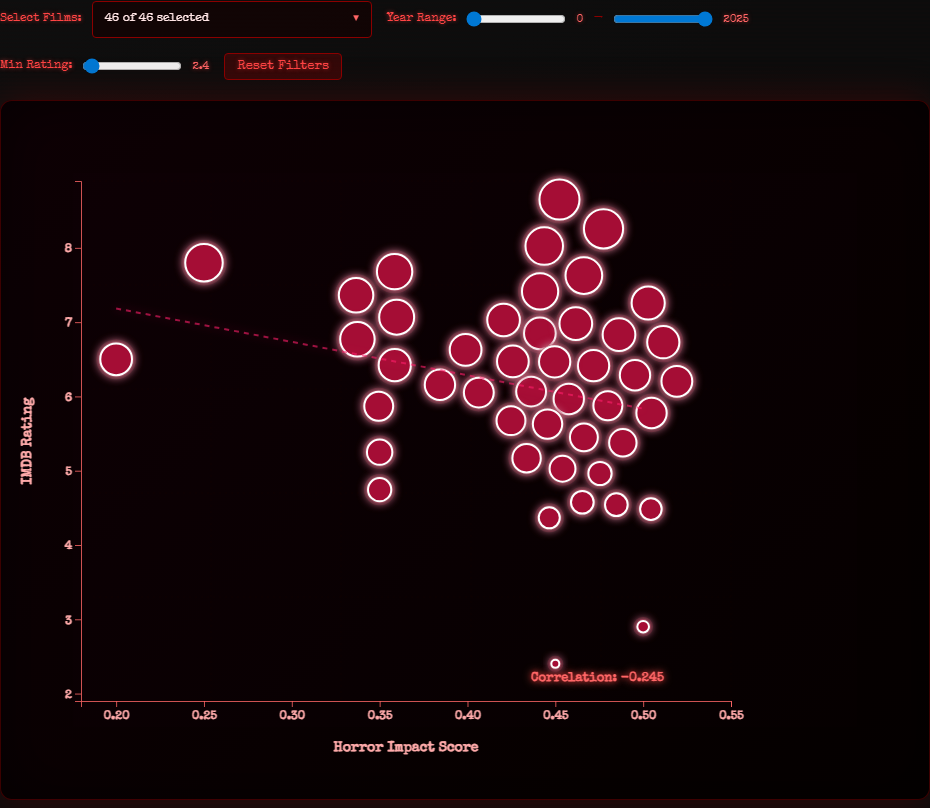
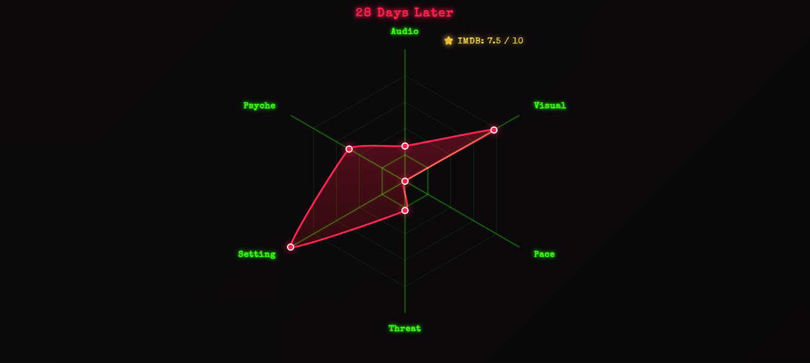
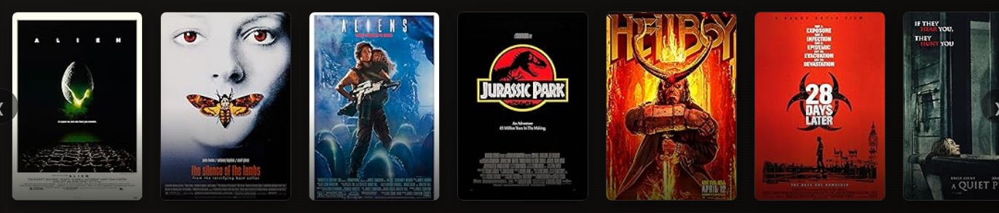

# The Anatomy of Fear

Interactive horror film analytics built with D3.js.

[Live site](https://calvin-liew.github.io/data-explorers-fear-analytics/) | [Methodology](docs/methodology.md) | [Data guide](docs/data-guide.md) | [Python pipeline](docs/python-pipeline.md)

## Overview

The Anatomy of Fear explores how horror films create dread through recurring
signals: screams, shadows, blood, darkness, pacing shifts, isolated settings,
direct threats, and psychological unease.

The project analyzes 129 horror screenplays, breaks them into 9,760 scenes, and
turns the resulting fear, tension, sentiment, and signal data into a scrolling
interactive story.

## Project Highlights

- **129 horror screenplays** used as the source corpus
- **9,760 scenes** extracted and analyzed
- **11,204 horror-signal mentions** across the scene-level signal table
- **D3.js visual narrative** with nine interactive sections
- **Python AI analysis pipeline** included under `analysis/`
- **Cleaned CSV datasets** included under `data/cleaner_datasets/`

## Screenshots

| Scene | Visualization |
| --- | --- |
| 1. Blood Flow of Horror |  |
| 2. Heartbeat of Terror |  |
| 3. Mapping the Spikes |  |
| 4. The Ladder of Fear |  |
| 5. What Actually Works |  |
| 6. Impact Dripline |  |
| 7. Does Scary Equal Good |  |
| 8. Horror Fingerprint |  |
| Final Act. Film Dossiers |  |

## Repository Structure

```text
.
|-- index.html                         # Single-page interactive story
|-- css/                               # Visual design and layout
|-- js/                                # D3 visualization modules
|-- data/
|   |-- cleaner_datasets/              # CSVs used directly by the site
|   |-- horror_ai_analysis_datasets/   # Scene-level AI analysis outputs
|   |-- horror_screenplays/            # Raw screenplay text files
|   `-- imdb-movies-dataset/           # Movie metadata and ratings
|-- analysis/                          # Original Python analysis pipeline
|-- docs/                              # Simplified methodology and data docs
`-- scripts/                           # Utility scripts, including screenshots
```

## Visual Story

1. **Blood Flow of Horror** shows which horror cues dominate the corpus.
2. **Heartbeat of Terror** traces fear across a film's normalized runtime.
3. **Mapping the Spikes** compares sudden fear and tension peaks by film.
4. **The Ladder of Fear** shows transitions between calm, unease, and panic.
5. **What Actually Works** compares signal frequency against emotional impact.
6. **Impact Dripline** ranks the strongest horror cues.
7. **Does Scary Equal Good** compares horror impact with IMDb rating.
8. **Horror Fingerprint** compares each film's mix of six horror families.
9. **Film Dossiers** lets users browse the full analyzed film set.

## Run Locally

D3 loads CSV files over HTTP, so run a local static server instead of opening
`index.html` directly.

```bash
python -m http.server 8000
```

Then open:

```text
http://localhost:8000
```

You can also use the npm script:

```bash
npm install
npm run serve
```

## Regenerate Screenshots

Screenshots are generated with Playwright and saved to `docs/screenshots/`.

```bash
npm install
npm run screenshots
```

## Reproduce the Analysis

The generated datasets are already committed, so rerunning the AI pipeline is
optional. To reproduce the analysis from the original screenplay text files:

```bash
cd analysis
python -m venv .venv
.\.venv\Scripts\activate
pip install -r requirements.txt
copy config.env.example config.env
```

Add your own OpenAI API key to `analysis/config.env`, then run:

```bash
python run_full_analysis.py
```

The full run uses the OpenAI API and asks for confirmation before starting.
For a deeper end-to-end explanation, see the [Python pipeline details](docs/python-pipeline.md).

## Documentation

- [Methodology](docs/methodology.md): how screenplays became structured data
- [Data guide](docs/data-guide.md): what each CSV contains
- [Python pipeline details](docs/python-pipeline.md): end-to-end parser flow and output meaning
- [Analysis pipeline](analysis/README.md): how to rerun the Python parser

## Tech Stack

- D3.js v7
- d3-sankey
- HTML, CSS, JavaScript
- Python, pandas, NumPy, OpenAI API
- Playwright for screenshot capture
